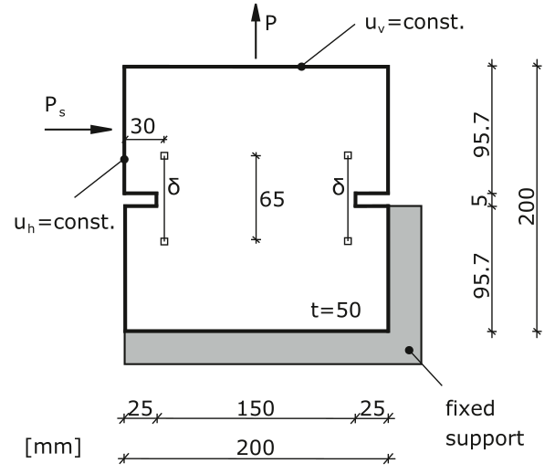
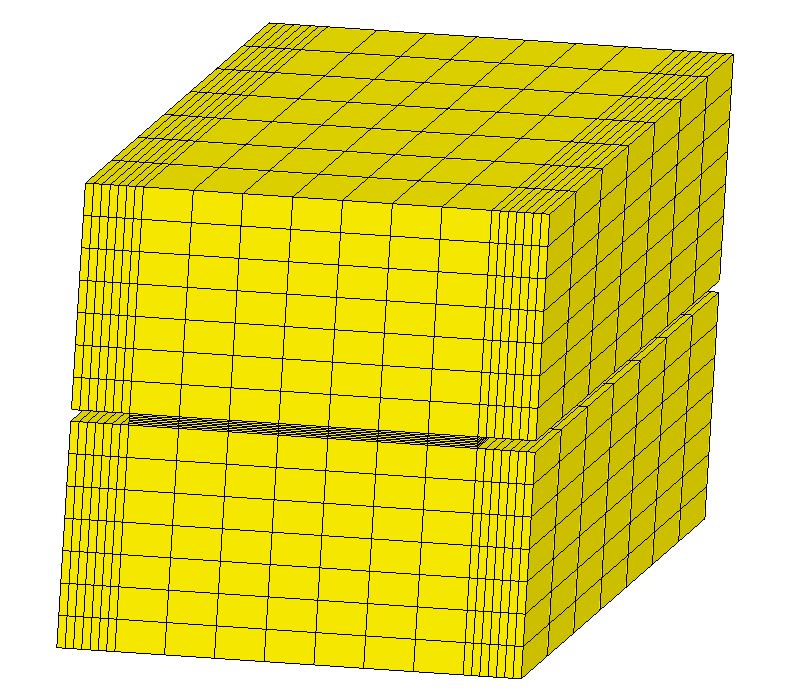

Cross section 1
===============

Let's consider a cross section.

We can use Matrix to create this type of geometry. First we need to decompose
geometry into blocks and then modify each of them according to the dimensions.

Axis X is directed to the right, Y - to the depth and
Z - upward. Cross section is symmetric along Y axis.

