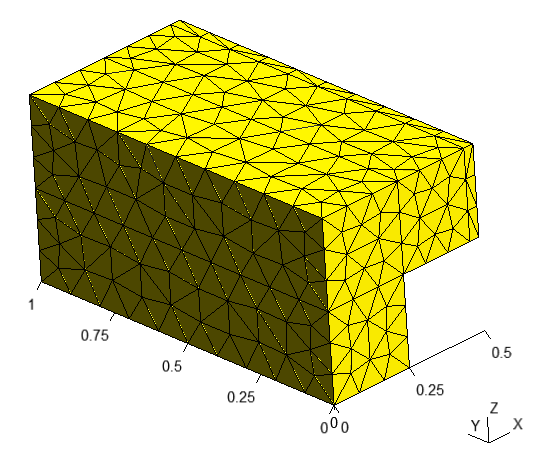

Cross section 2
===============

Let's consider a cross section (See `examples/matrix/cross_section_2`_)

.. _examples/matrix/cross_section_2: https://github.com/romanzes637/gmsh_scripts/tree/master/examples/matrix/cross_section_2


   Cross section

We can use :py:class:`~gmsh_scripts.block.matrix.Matrix` class to create this type of
geometry. First we need to decompose geometry into blocks and then modify each of
them according to the dimensions.

Decomposition
-------------
Geometry could be decomposed into 4 blocks: ``BOTTOM``, ``TOP1``, ``TOP2`` and ``TOP3``,
where ``TOP3`` part is required for a small surface with :math:`F`, :math:`u_v`
boundary condition at the end of the upper part of the geometry. Without the boundary
condition, 3 blocks would be enough. Each of these blocks will be described by
:py:class:`~gmsh_scripts.block.matrix.Matrix` class.


   Decomposition of geometry

Geometry
--------
Let's define that X-axis is directed to the right, Y - in the depth and Z - upward, i.e
cross section is symmetric along Y-axis.

First we should create a separate file for each of the blocks:

* ``top_1.yaml``

.. code-block:: yaml
   :linenos:

    data:
      class: block.Matrix
      matrix: [ [ 0, 0.250 ], [ 0, 1 ], [ 0, 0.250 ] ]

* ``top_2.yaml``

.. code-block:: yaml
   :linenos:

     data:
       class: block.Matrix
       matrix: [ [ 0, 0.220 ], [ 0, 1 ], [ 0, 0.250 ] ]

* ``top_3.yaml``

.. code-block:: yaml
   :linenos:

    data:
      class: block.Matrix
      matrix: [ [ 0, 0.030 ], [ 0, 1 ], [ 0, 0.250 ] ]

* ``bottom.yaml``

.. code-block:: yaml
   :linenos:

    data:
      class: block.Matrix
      matrix: [ [ 0, 0.250 ], [ 0, 1 ], [ 0, 0.250 ] ]

Each of the files consists of one high level field ``data`` whose has 2 fields:
1. ``class`` - name of the class of the block
2. ``matrix`` - lists of point coordinates by axes

For example Matrix has 2 points by X-axis with coordinates ``0`` and ``0.250``.

Matrix also has 2 points by Y-axis with ``0`` and ``1`` coordinates and 2 points by
Z-axis with ``0`` and ``0.250``. Thus Matrix is a box with dimensions: ``0.250``,
``1`` and ``0.250`` by X, Y and Z axis respectively and origin at point ``(0, 0, 0)``.

We could generate geometry of ``bottom.yaml`` into ``bottom.geo_unrolled`` file:

.. code-block:: shell

   python -m gmsh_scripts bottom.yaml


   Geometry of the the ``BOTTOM`` block

Now we should create main file ``main.yaml`` with all blocks:

.. code-block:: yaml
   :linenos:

    data:
      class: block.Block
      do_register: 0
      children: [
        /bottom.yaml,
        /top_1.yaml,
        /top_2.yaml,
        /top_3.yaml
      ]
      children_transforms: [
        [ ],
        [ [ 0, 0, 0.250 ] ],
        [ [ 0.250, 0, 0.250 ] ],
        [ [ 0.470, 0, 0.250 ] ]
      ]

File also has one high level field ``data`` with 4 sub-fields:

1. ``class`` - name of the class of the block
2. ``do_register`` - create this block? (set 0 because we don't need this block itself, i.e. it's only a container for other blocks)
3. ``children`` - references to other block files (should start with ``/`` character)
4. ``children_transforms`` - transforms of other blocks

Field ``children_transforms`` is a list of
:py:class:`~gmsh_scripts.transform.transform.Transform` for each ``children``.
In this tutorial we only need simple
:py:class:`~gmsh_scripts.transform.transform.Translate` that are given by 3 numbers -
offset along X, Y ans Z axes respectively.

For example:

1. Child ``bottom.yaml`` has no transforms
2. Child ``top_1.yaml`` has one :py:class:`~gmsh_scripts.transform.transform.Translate` ``[ 0, 0, 0.250 ]`` with offset 0.250 by Z-axis and no offsets by X and Y (we just need to elevate to the ``bottom.yaml``)
3. Child ``top_2.yaml`` has one :py:class:`~gmsh_scripts.transform.transform.Translate` ``[ 0.250, 0, 0.250 ]``
4. Child ``top_3.yaml`` has one :py:class:`~gmsh_scripts.transform.transform.Translate` ``[ 0.470, 0, 0.250 ]``

Let's generate geometry with all blocks into ``main.geo_unrolled``:

.. code-block:: shell

   python -m gmsh_scripts main.yaml


   Geometry with all blocks

Mesh
----

To generate mesh we should add ``metadata`` field to the ``main.yaml`` file:

.. code-block:: yaml
   :linenos:

    metadata:
      run:
        factory: geo
        strategy:
          class: strategy.NoBoolean
    data:
      class: block.Block
      do_register: 0
      children: [
        /bottom.yaml,
        /top_1.yaml,
        /top_2.yaml,
        /top_3.yaml
      ]
      children_transforms: [
        [ ],
        [ [ 0, 0, 0.250 ] ],
        [ [ 0.250, 0, 0.250 ] ],
        [ [ 0.470, 0, 0.250 ] ]
      ]

File ``metadata`` has ``run`` sub-field with fields:

1. ``factory`` - Which kernel of gmsh to use for mesh generation? Currently, gmsh has two `kernels <https://gmsh.info/doc/texinfo/gmsh.html#Overview-of-Gmsh>`_: ``geo`` and ``occ``. We use ``geo`` because it's faster
2. ``strategy`` - :py:class:`~gmsh_scripts.strategy.strategy.Strategy` of mesh generation
3. ``strategy.class`` - Class of the strategy. We use :py:class:`~gmsh_scripts.strategy.strategy.NoBoolean` because we don't need boolean operations

.. warning::
   If we need boolean operations we MUST use ``occ`` factory with default strategy
   (just don't set it in the ``metadata``)

Now mesh generator will return mesh into ``main.msh2`` file (it also returns
``main.geo_unrolled`` as before). Generator creates unstructured tetrahedral mesh
by default.

.. code-block:: shell

   python -m gmsh_scripts main.yaml


   Default mesh

Unstructured Tetrahedral
::::::::::::::::::::::::

We can customize unstructured mesh with parameters in input files.

First type of parameters aka ``point parameters`` is set in ``matrix`` field
(e.g. ``bottom.yaml``):

.. code-block:: yaml
   :linenos:

   data:
     class: block.Matrix
     matrix: [ [ 0;0.01, 0.250;0.1 ], [ 0;0.01, 1;0.1 ], [ 0;0.01, 0.250;0.1 ] ]

As one can see, for each point a new parameter have been added with ``;`` separator,
e.g. ``0;0.01`` for first point by X-axis or ``0.250;0.1`` for second point by Z-axis.
Parameters ``0.01`` or ``0.1`` are approximate sizes of the mesh near
the corresponding points.

In this example, mesh is finer near the ``(0, 0, 0)`` point with size ``0.01``
and coarser near the ``(0.250, 1, 0.250)`` point with size ``0.1``.

Let's add ``metadata`` field to ``bottom.yaml`` and generate mesh:

.. code-block:: shell

   python -m gmsh_scripts bottom.yaml

.. code-block:: yaml
   :linenos:

   metadata:
     run:
       factory: geo
       strategy:
         class: strategy.NoBoolean
   data:
     class: block.Matrix
     matrix: [ [ 0;0.01, 0.250;0.1 ], [ 0;0.01, 1;0.1 ], [ 0;0.01, 0.250;0.1 ] ]


   Unstructured tetrahedral mesh of the ``BOTTOM`` block

One could fix mesh size along one of the axis (e.g. Y with ``0.01``):

.. code-block:: yaml
   :linenos:

   metadata:
     run:
       factory: geo
       strategy:
         class: strategy.NoBoolean
   data:
     class: block.Matrix
     matrix: [ [ 0;0.01, 0.250;0.1 ], [ 0;0.01, 1;0.01 ], [ 0;0.01, 0.250;0.1 ] ]


   Unstructured tetrahedral mesh with fixed size along Y-axis of the ``BOTTOM`` block

To generate all blocks, one needs to specify point parameters at all blocks
and run generator:

.. code-block:: shell

   python -m gmsh_scripts main.yaml


   Unstructured tetrahedral mesh with fixed size along Y-axis at ``BOTTOM`` block

Second type of parameters aka ``global parameters`` is set in ``metadata.run.options``
field (e.g. ``bottom.yaml``):

.. code-block:: yaml
   :linenos:

   metadata:
     run:
       factory: geo
       strategy:
         class: strategy.NoBoolean
       options:
         Mesh.MeshSizeFactor: 0.5
         Mesh.MeshSizeMin: 0
         Mesh.MeshSizeMax: 1.0e+22
         Mesh.MeshSizeFromPoints: 1
   data:
     class: block.Matrix
     matrix: [ [ 0;0.01, 0.250;0.1 ], [ 0;0.01, 1;0.01 ], [ 0;0.01, 0.250;0.1 ] ]

Here are 4 options (many other options available, see `gmsh documentation <https://gmsh.info/doc/texinfo/gmsh.html#Mesh-options>`_):
1. ``Mesh.MeshSizeFactor`` - factor applied to all mesh element sizes
2. ``Mesh.MeshSizeMin`` - minimum mesh element size
3. ``Mesh.MeshSizeMax`` - maximum mesh element size
4. ``Mesh.MeshSizeFromPoints`` - compute mesh element sizes from values given at geometry points (e.g. in ``matrix`` field)

In this example ``Mesh.MeshSizeFactor`` is set to ``0.5`` that generate mesh that is twice as fine.


   Unstructured tetrahedral mesh with ``Mesh.MeshSizeFactor = 0.5``

One could disable ``Mesh.MeshSizeFromPoints`` (set to ``0``) to create uniform mesh
whose size is controlled only by ``global parameters``.

.. code-block:: yaml
   :linenos:

   metadata:
     run:
       factory: geo
       strategy:
         class: strategy.NoBoolean
       options:
         Mesh.MeshSizeFactor: 1
         Mesh.MeshSizeMin: 0
         Mesh.MeshSizeMax: 1.0e+22
         Mesh.MeshSizeFromPoints: 0
   data:
     class: block.Matrix
     matrix: [ [ 0;0.01, 0.250;0.1 ], [ 0;0.01, 1;0.01 ], [ 0;0.01, 0.250;0.1 ] ]


   Unstructured tetrahedral mesh with ``Mesh.MeshSizeFromPoints = 0``

Then we could use to control mesh size, e.g with ``Mesh.MeshSizeMax`` = ``0.1``:

.. code-block:: yaml
   :linenos:

   metadata:
     run:
       factory: geo
       strategy:
         class: strategy.NoBoolean
       options:
         Mesh.MeshSizeFactor: 1
         Mesh.MeshSizeMin: 0
         Mesh.MeshSizeMax: 0.1
         Mesh.MeshSizeFromPoints: 0
   data:
     class: block.Matrix
     matrix: [ [ 0, 0.250 ], [ 0, 1 ], [ 0, 0.250 ] ]


   Unstructured mesh with ``Mesh.MeshSizeMax = 0.1``

To generate all blocks, one needs to specify ``global parameters`` in ``main.yaml``:

.. code-block:: yaml
   :linenos:

    metadata:
      run:
        factory: geo
        strategy:
          class: strategy.NoBoolean
        options:
          Mesh.MeshSizeFactor: 1
          Mesh.MeshSizeMin: 0
          Mesh.MeshSizeMax: 0.1
          Mesh.MeshSizeFromPoints: 0
    data:
      class: block.Block
      do_register: 0
      children: [
        /bottom.yaml,
        /top_1.yaml,
        /top_2.yaml,
        /top_3.yaml
      ]
      children_transforms: [
        [ ],
        [ [ 0, 0, 0.250 ] ],
        [ [ 0.250, 0, 0.250 ] ],
        [ [ 0.470, 0, 0.250 ] ]
      ]


.. code-block:: shell

   python -m gmsh_scripts main.yaml



   Unstructured tetrahedral mesh controlled by ``global parameters``

Unstructured Hexahedral
:::::::::::::::::::::::

.. warning::
   Generation of hexahedral unstructured mesh is
   `experimental <https://gitlab.onelab.info/gmsh/gmsh/-/issues/1791>`_ so not always
   creates a quality mesh, it depends on the complexity of the geometry.

Unstructured hexahedral parameters are set in ``metadata.run.options`` field
and have ``Recombine`` in their names
(see `gmsh options <https://gmsh.info/doc/texinfo/gmsh.html#Mesh-options>`_)

To generate unstructured hexahedral mesh parameter ```Mesh.SubdivisionAlgorithm``
should be set greater than ``1``
(see `tutorial 11 of gmsh <https://gmsh.info/doc/texinfo/gmsh.html#t11>`_
for more information)

.. code-block:: yaml
   :linenos:

   metadata:
     run:
       factory: geo
       strategy:
         class: strategy.NoBoolean
       options:
         Mesh.MeshSizeFactor: 1
         Mesh.MeshSizeMin: 0
         Mesh.MeshSizeMax: 0.1
         Mesh.MeshSizeFromPoints: 0
         Mesh.SubdivisionAlgorithm: 2
   data:
     class: block.Matrix
     matrix: [ [ 0, 0.250 ], [ 0, 1 ], [ 0, 0.250 ] ]

.. code-block:: shell

   python -m gmsh_scripts bottom.yaml


   Unstructured hexahedral mesh of ``bottom.yaml``

To generate unstructured hexahedral mesh of all blocks add parameters to ``metadata`` of
``main.yaml``:

.. code-block:: yaml
   :linenos:

    metadata:
      run:
        factory: geo
        strategy:
          class: strategy.NoBoolean
        options:
          Mesh.MeshSizeFactor: 1
          Mesh.MeshSizeMin: 0
          Mesh.MeshSizeMax: 0.1
          Mesh.MeshSizeFromPoints: 0
          Mesh.SubdivisionAlgorithm: 2
    data:
      class: block.Block
      do_register: 0
      children: [
        /bottom.yaml,
        /top_1.yaml,
        /top_2.yaml,
        /top_3.yaml
      ]
      children_transforms: [
        [ ],
        [ [ 0, 0, 0.250 ] ],
        [ [ 0.250, 0, 0.250 ] ],
        [ [ 0.470, 0, 0.250 ] ]
      ]

.. code-block:: shell

   python -m gmsh_scripts main.yaml


   Unstructured hexahedral mesh

Structured Tetrahedral
::::::::::::::::::::::

To create structured tetrahedral mesh one should add third parameter to the points
at ``matrix`` field with ``;`` separator, e.g. in ``bottom.yaml``:

.. code-block:: yaml
   :linenos:

   metadata:
      run:
        factory: geo
        strategy:
          class: strategy.NoBoolean

   data:
     class: block.Matrix
     matrix: [ [ 0;0.01, 0.250;0.1;4 ], [ 0;0.01, 1;0.1;8 ], [ 0;0.01, 0.250;0.1;16 ] ]

Third argument should be set only for second point and specifies number of nodes along
corresponding direction. E.g. ``4`` nodes by X-axis, ``8`` nodes by Y and ``16`` by Z.

.. code-block:: shell

   python -m gmsh_scripts bottom.yaml


   Structured tetrahedral mesh of the ``BOTTOM`` block

One could disable structured mesh generation by setting ``items_do_structure_map`` to
``0`` (``1`` by default) in the ``data`` field:

.. code-block:: yaml
   :linenos:

   metadata:
      run:
        factory: geo
        strategy:
          class: strategy.NoBoolean

   data:
     class: block.Matrix
     matrix: [ [ 0;0.01, 0.250;0.1;4 ], [ 0;0.01, 1;0.1;8 ], [ 0;0.01, 0.250;0.1;16 ] ]
     items_do_structure_map: 0


   Unstructured tetrahedral mesh of the ``BOTTOM`` block with ``items_do_structure_map`` = ``0``

To create structured tetrahedral mesh with all blocks one should set third parameter in
each of the blocks and run ``main.yaml``

.. warning::
   Number of nodes MUST be consistent between adjacent blocks, e.g. all ``TOP``
   blocks should have the same number of nodes by Y and Z axis

* ``top_1.yaml``

.. code-block:: yaml
   :linenos:

    data:
      class: block.Matrix
      matrix: [ [ 0, 0.250;0.1;8 ], [ 0, 1;0.1;8 ], [ 0, 0.250;0.1;8 ] ]

* ``top_2.yaml``

.. code-block:: yaml
   :linenos:

     data:
       class: block.Matrix
       matrix: [ [ 0, 0.220;0.1;8 ], [ 0, 1;0.1;8 ], [ 0, 0.250;0.1;8 ] ]

* ``top_3.yaml``

.. code-block:: yaml
   :linenos:

    data:
      class: block.Matrix
      matrix: [ [ 0, 0.030;0.1;8 ], [ 0, 1;0.1;8 ], [ 0, 0.250;0.1;8 ] ]

* ``bottom.yaml``

.. code-block:: yaml
   :linenos:

    data:
      class: block.Matrix
      matrix: [ [ 0, 0.250;0.1;8 ], [ 0, 1;0.1;8 ], [ 0, 0.250;0.1;8 ] ]

.. code-block:: shell

   python -m gmsh_scripts main.yaml

.. figure:: ../../images/cross_section_2_mesh_structured_tetrahedral_main_1.png
   :width: 400px
   :align: center

   Structured tetrahedral mesh

To disable generation of structured mesh for all blocks at once one should set
``children_items_do_structure_map`` = ``[0, ..., number of children]`` at parent block,
e.g. for ``main.yaml``:

.. code-block:: yaml
   :linenos:

    metadata:
      run:
        factory: geo
        strategy:
          class: strategy.NoBoolean
    data:
      class: block.Block
      do_register: 0
      children: [
        /bottom.yaml,
        /top_1.yaml,
        /top_2.yaml,
        /top_3.yaml
      ]
      children_transforms: [
        [ ],
        [ [ 0, 0, 0.250 ] ],
        [ [ 0.250, 0, 0.250 ] ],
        [ [ 0.470, 0, 0.250 ] ]
      ]
      children_items_do_structure_map: [0, 0, 0, 0]


   Structured tetrahedral mesh with disabled ``children_items_do_structure_map``

Structured Hexahedral
:::::::::::::::::::::

For creating structured hexahedral mesh one could do the same steps as for
`Structured Tetrahedral`_ but with ``items_do_quadrate_map`` = ``1`` (``0`` by default)
in the ``data`` field:

.. code-block:: yaml
   :linenos:

   metadata:
      run:
        factory: geo
        strategy:
          class: strategy.NoBoolean

   data:
     class: block.Matrix
     matrix: [ [ 0;0.01, 0.250;0.1;4 ], [ 0;0.01, 1;0.1;8 ], [ 0;0.01, 0.250;0.1;16 ] ]
     items_do_quadrate_map: 1

.. code-block:: shell

   python -m gmsh_scripts bottom.yaml


   Structured hexahedral mesh of the ``BOTTOM`` block

One could change positions of nodes along axes using one of the two methods:

1. ``progression`` - increase/decrease space between nodes from start point to end point
2. ``bump`` - increase/decrease space between node from center to points

To use ``progression`` we should specify 2 additional sub-parameters to the third
parameter separated by ``:``:

1. The first one is ``0`` (which choose ``progression`` type)
2. The second is a coefficient of the ``progression`` - if coefficient > 1 space will be increasing from first point to second else decreasing

For example, ``progression`` sub-parameters ``0:1.5`` for Y-axis:

.. code-block:: yaml
   :linenos:

   metadata:
      run:
        factory: geo
        strategy:
          class: strategy.NoBoolean

   data:
     class: block.Matrix
     matrix: [ [ 0;0.01, 0.250;0.1;4 ], [ 0;0.01, 1;0.1;8:0:1.5 ], [ 0;0.01, 0.250;0.1;16 ] ]
     items_do_quadrate_map: 1


   Structured hexahedral mesh with ``progression`` = `1.5`

For example, ``progression`` sub-parameters ``0:0.75`` for Y-axis:

.. code-block:: yaml
   :linenos:

   metadata:
      run:
        factory: geo
        strategy:
          class: strategy.NoBoolean

   data:
     class: block.Matrix
     matrix: [ [ 0;0.01, 0.250;0.1;4 ], [ 0;0.01, 1;0.1;8:0:0.75 ], [ 0;0.01, 0.250;0.1;16 ] ]
     items_do_quadrate_map: 1


   Structured hexahedral mesh with ``progression`` = `0.75`

To use ``bump`` we should specify 2 additional sub-parameters to the third parameter
separated by ``:``:

1. The first one is ``1`` (which choose ``bump`` type)
2. The second is a coefficient of the ``bump`` - if coefficient > 1 space will be increasing from the center else decreasing

For example, ``bump`` sub-parameters ``1:2.0`` for Y-axis:

.. code-block:: yaml
   :linenos:

   metadata:
      run:
        factory: geo
        strategy:
          class: strategy.NoBoolean

   data:
     class: block.Matrix
     matrix: [ [ 0;0.01, 0.250;0.1;4 ], [ 0;0.01, 1;0.1;8:1:2.0 ], [ 0;0.01, 0.250;0.1;16 ] ]
     items_do_quadrate_map: 1


   Structured hexahedral mesh with ``bump`` = `2.0`

For example, ``bump`` sub-parameters ``1:0.5`` for Y-axis:

.. code-block:: yaml
   :linenos:

   metadata:
      run:
        factory: geo
        strategy:
          class: strategy.NoBoolean

   data:
     class: block.Matrix
     matrix: [ [ 0;0.01, 0.250;0.1;4 ], [ 0;0.01, 1;0.1;8:1:0.5 ], [ 0;0.01, 0.250;0.1;16 ] ]
     items_do_quadrate_map: 1


   Structured hexahedral mesh with ``bump`` = `0.5`

To generate structured hexahedral mesh of all blocks one could set
``items_do_quadrate_map`` = ``0`` at each of the blocks or set
``children_items_do_quadrate_map`` = ``[0, ..., number of children]`` at parent block,
e.g. for ``main.yaml``:

.. code-block:: yaml
   :linenos:

    metadata:
      run:
        factory: geo
        strategy:
          class: strategy.NoBoolean
    data:
      class: block.Block
      do_register: 0
      children: [
        /bottom.yaml,
        /top_1.yaml,
        /top_2.yaml,
        /top_3.yaml
      ]
      children_transforms: [
        [ ],
        [ [ 0, 0, 0.250 ] ],
        [ [ 0.250, 0, 0.250 ] ],
        [ [ 0.470, 0, 0.250 ] ]
      ]
      children_items_do_quadrate_map: [1, 1, 1, 1]

.. code-block:: shell

   python -m gmsh_scripts main.yaml


   Structured hexahedral mesh

Zones
-----

If we want to add names to entities of the mesh (e.g. volumes of surfaces) we should set
additional field ``items_zones`` in the ``data`` field

For example, we can add ``[ [ Volume, [ NX, X, NY, Y, NZ, Z ] ] ]``
in the``bottom.yaml``, where:

1. ``Volume`` - volume name
2. ``[ NX, X, NY, Y, NZ, Z ]`` - surfaces names:

   * ``NX`` - surface pointing in the opposite direction of X-axis
   * ``X`` - surface pointing in the direction of X-axis
   * ``NY`` - surface pointing in the opposite direction of Y-axis
   * ``Y`` - surface pointing in the direction of Y-axis
   * ``NZ`` - surface pointing in the opposite direction of Z-axis
   * ``Z`` - surface pointing in the direction of Z-axis

.. code-block:: yaml
   :linenos:

   metadata:
      run:
        factory: geo
        strategy:
          class: strategy.NoBoolean

   data:
     class: block.Matrix
     matrix: [ [ 0;0.01, 0.250;0.1;4 ], [ 0;0.01, 1;0.1;8 ], [ 0;0.01, 0.250;0.1;16 ] ]
     items_zone: [ [ Volume, [ NX, X, NY, Y, NZ, Z ] ] ]
     items_do_quadrate_map: 1


   Structured hexahedral with zones

Result
------

.. note::
   We should define different zone names of bottom surfaces of ``TOP2`` and ``TOP3``,
   e.g. ``Top2NZ`` and ``Top3NZ`` respectively

* ``top_1.yaml``

.. code-block:: yaml
   :linenos:

   data:
     class: block.Matrix
     matrix: [ [ 0;0.1, 0.250;0.1;8 ], [ 0;0.1, 1;0.1;8 ], [ 0;0.1, 0.250;0.1;8 ] ]
     items_zone: [ [ Volume, [ NX, X, NY, Y, NZ, Z ] ] ]

* ``top_2.yaml``

.. code-block:: yaml
   :linenos:

   data:
     class: block.Matrix
     matrix: [ [ 0;0.1, 0.220;0.1;8 ], [ 0;0.1, 1;0.1;8 ], [ 0;.1, 0.250;0.1;8 ] ]
     items_zone: [ [ Volume, [ NX, X, NY, Y, Top2NZ, Z ] ] ]

* ``top_3.yaml``

.. code-block:: yaml
   :linenos:

   data:
     class: block.Matrix
     matrix: [ [ 0;0.1, 0.030;0.1;8 ], [ 0;0.1, 1;0.1;8 ], [ 0;.1, 0.250;0.1;8 ] ]
     items_zone: [ [ Volume, [ NX, X, NY, Y, Top3NZ, Z ] ] ]

* ``bottom.yaml``

.. code-block:: yaml
   :linenos:

   data:
     class: block.Matrix
     matrix: [ [ 0;.1, 0.250;.1;8 ], [ 0;.1, 1;.1;8 ], [ 0;.1, 0.250;.1;8 ] ]
     items_zone: [ [ Volume, [ NX, X, NY, Y, NZ, Z ] ] ]

* ``main.yaml``

.. code-block:: yaml
   :linenos:

   metadata:
     run:
       factory: geo
       strategy:
         class: strategy.NoBoolean
   data:
     class: block.Block
     do_register: 0
     children: [
       /bottom.yaml,
       /top_1.yaml,
       /top_2.yaml,
       /top_3.yaml
     ]
     children_transforms: [
       [ ],
       [ [ 0, 0, 0.250 ] ],
       [ [ 0.250, 0, 0.250 ] ],
       [ [ 0.470, 0, 0.250 ] ]
     ]
     children_items_do_quadrate_map: [ 1, 1, 1, 1 ]
     children_items_do_structure_map: [ 1, 1, 1, 1 ]

.. code-block:: shell

   python -m gmsh_scripts main.yaml


   Mesh
