Simple Children
===============

Concept
-------

Each successor of class :py:class:`~gmsh_scripts.block.block.Block` can have children
blocks. Each class with ``items`` (currently
:py:class:`~gmsh_scripts.block.matrix.Matrix` and
:py:class:`~gmsh_scripts.block.layer.Layer`) can have children for each ``item``.

Every child is a gmsh_scripts file in JSON or YAML format.

Children are specified in ``data.children`` field. One could set ``transforms`` for
children at ``data.children_transforms`` field.

Items children are specified in ``data.items_children`` One should
set ``data.items_children_transforms`` and ``data.items_children_transforms_map``
to apply transformations to them.

Children
--------

Let's create two children and one parent. Children are instances of class
:py:class:`~gmsh_scripts.block.layer.Layer`, i.e. they are cylinders with different
radius. Parent is an instance of class
:py:class:`~gmsh_scripts.block.block.Block` and has 3 ``items`` arranged along X-axis.

We create them structured and quadrated for convenience.

* Child 1

.. code-block:: yaml
   :linenos:

   metadata:
     run:
       factory: geo
       strategy:
         class: strategy.NoBoolean
   data:
     class: block.Layer
     layer: [ [ 0.05;;4, 0.15;;4 ],
              [ 0.1;;2, 0.3;;2 ] ]
     layer_curves: [ [ line, circle_arc ],
                     [ line, line ] ]
     items_zone: [ CHILD_1 ]
     items_do_structure_map: 1
     items_do_quadrate_map: 1

.. code-block:: shell

   python -m gmsh_scripts child_1.yaml

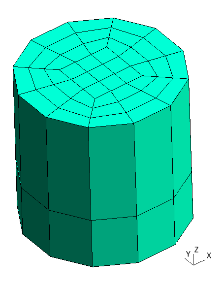

   Child 1

* Child 2

.. code-block:: yaml
   :linenos:

   metadata:
     run:
       factory: geo
       strategy:
         class: strategy.NoBoolean
   data:
     class: block.Layer
     layer: [ [ 0.1;;4, 0.3;;4 ],
              [ 0.1;;2, 0.3;;2 ] ]
     layer_curves: [ [ line, circle_arc ],
                     [ line, line ] ]
     items_zone: [ CHILD_2 ]
     items_do_structure_map: 1
     items_do_quadrate_map: 1

.. code-block:: shell

   python -m gmsh_scripts child_2.yaml

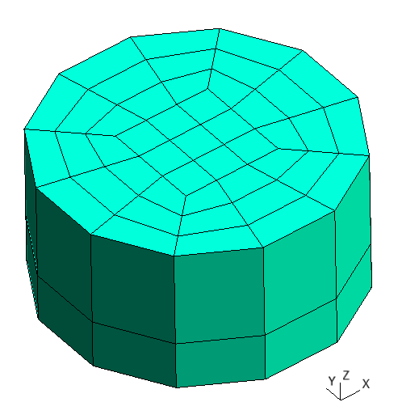

   Child 2

* Parent

.. code-block:: yaml
   :linenos:

   metadata:
     run:
       factory: geo
       strategy:
         class: strategy.NoBoolean
   data:
     class: block.Matrix
     matrix: [ [ 0;;2, 1;;2, 2;;2, 3;;2 ],
               [ 0;;2, 1;;2 ],
               [ 0;;2, 1;;2 ] ]
     items_zone: [ PARENT ]
     items_do_structure_map: 1
     items_do_quadrate_map: 1

.. code-block:: shell

   python -m gmsh_scripts parent.yaml

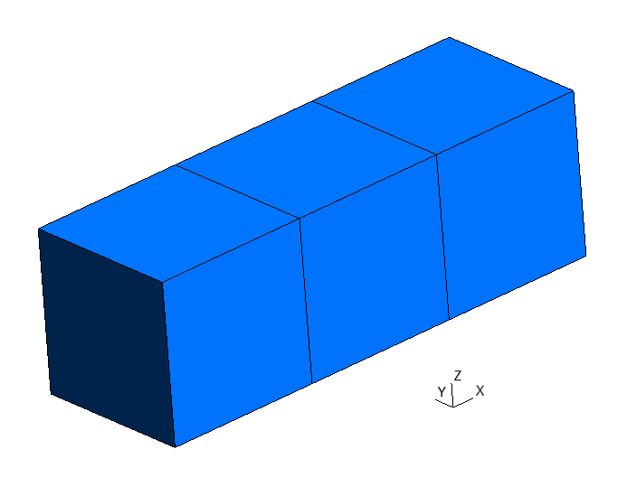

   Parent

One can add children to parent specifying ``data.children`` with list of file
names of children started with ``/`` character.

.. code-block:: yaml
   :linenos:

   metadata:
     run:
       factory: geo
       strategy:
         class: strategy.NoBoolean
   data:
     class: block.Matrix
     matrix: [ [ 0;;2, 1;;2, 2;;2, 3;;2 ],
               [ 0;;2, 1;;2 ],
               [ 0;;2, 1;;2 ] ]
     items_zone: [ PARENT ]
     children: [
       /child_1.yaml,
       /child_2.yaml
     ]
     items_do_structure_map: 1
     items_do_quadrate_map: 1

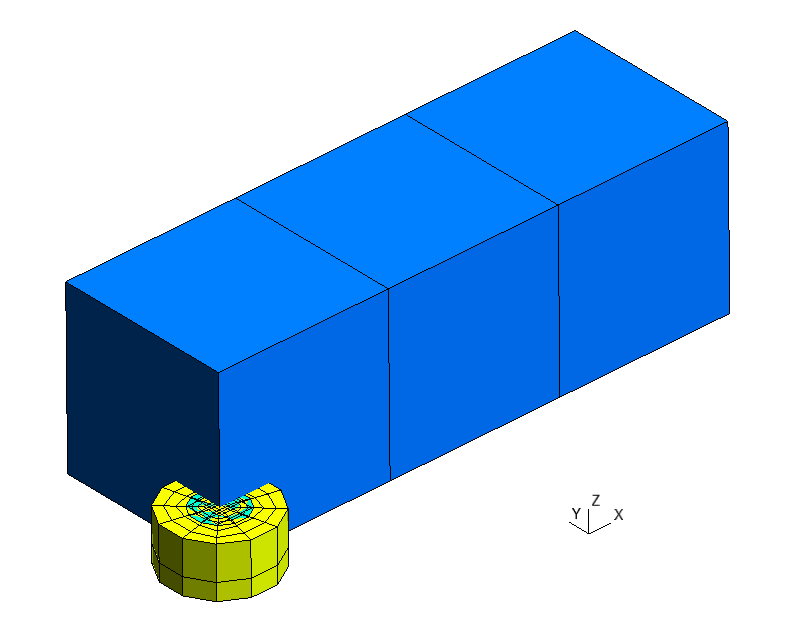

   Parent with ``children`` without ``children_transforms``

As one can see, children are placed in their origin ``(0, 0, 0)``. To move them
to another location use ``data.children_transforms`` field that contains ``transforms``
for each children according with their position in ``data.children`` field.

In this example, we move first child by -1 and second child by 2 along Y-axis.

.. code-block:: yaml
   :linenos:

   metadata:
     run:
       factory: geo
       strategy:
         class: strategy.NoBoolean
   data:
     class: block.Matrix
     matrix: [ [ 0;;2, 1;;2, 2;;2, 3;;2 ],
               [ 0;;2, 1;;2 ],
               [ 0;;2, 1;;2 ] ]
     items_zone: [ PARENT ]
     children: [
       /child_1.yaml,
       /child_2.yaml
     ]
     children_transforms: [
       [ [ 0, -1, 0] ],
       [ [ 0, 2, 0] ]
     ]
     items_do_structure_map: 1
     items_do_quadrate_map: 1

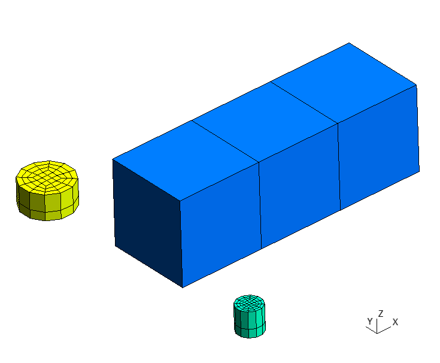

   Parent with ``children`` with ``children_transforms``

Items Children
--------------

Adding items children is a little trickier: first we need specify children for each
item, then apply transformations to each child of each item.

Working with ``items`` consists of 2 steps: creating ``main field`` with options and
then creating ``addressing field``, that ends with ``_map`` suffix with exception of
fields with ``do_`` prefix, they don't need ``main field``. Each value in
``addressing field`` is an index in ``main field`` and position of value indicates
to which ``item`` of :py:class:`~gmsh_scripts.block.matrix.Matrix` or
:py:class:`~gmsh_scripts.block.layer.Layer` should be assigned option from
``main_field``.

In this example, parent has 3 items, so addressing fields will have length of 3.
First we need to define main field for children ``items_children`` then
addressing field ``items_children_map``.

``items_children`` consists of 3 options, first and second assign one child to an item
and third - two:

1. ``/child_1.yaml``,
2. ``/child_2.yaml``,
3. ``/child_1.yaml`` and ``/child_2.yaml``.

``items_children_map`` assigns first option from ``items_children`` to first item,
second option from ``items_children`` to second item, and third to third: ``[0, 1, 2]``.

Similarly fields ``items_children_transforms`` and ``items_children_transforms_map``
are set.

``items_children_transforms`` consists of 2 options, first assign no
transforms to one child and third one transform to two children:

1. ``[ [ ] ]``,
2. ``[ [ [ 0, 0, 0.1 ] ], [ [ 0, 0, -0.3 ] ] ]``.

``items_children_transforms_map`` assigns first option from ``items_children`` to first
and second items and second option to third: ``[0, 0, 1]``.

It's convenient to create only geometry instead of mesh while working with
children and their transformations.

.. code-block:: yaml
   :linenos:

   metadata:
     run:
       factory: geo
   data:
     class: block.Matrix
     matrix: [ [ 0;;2, 1;;2, 2;;2, 3;;2 ],
               [ 0;;2, 1;;2 ],
               [ 0;;2, 1;;2 ] ]
     items_zone: [ PARENT ]
     items_children: [
       [ /child_1.yaml ],
       [ /child_2.yaml ],
       [ /child_1.yaml, /child_2.yaml ],
     ]
     items_children_map: [
       0, 1, 2
     ]
     items_children_transforms: [
       [ [ ] ],
       [ [ [ 0, 0, 0.1 ] ], [ [ 0, 0, -0.3 ] ] ],
     ]
     items_children_transforms_map: [
       0, 0, 1
     ]
     items_do_structure_map: 1
     items_do_quadrate_map: 1

.. code-block:: shell

   python -m gmsh_scripts parent_items.yaml

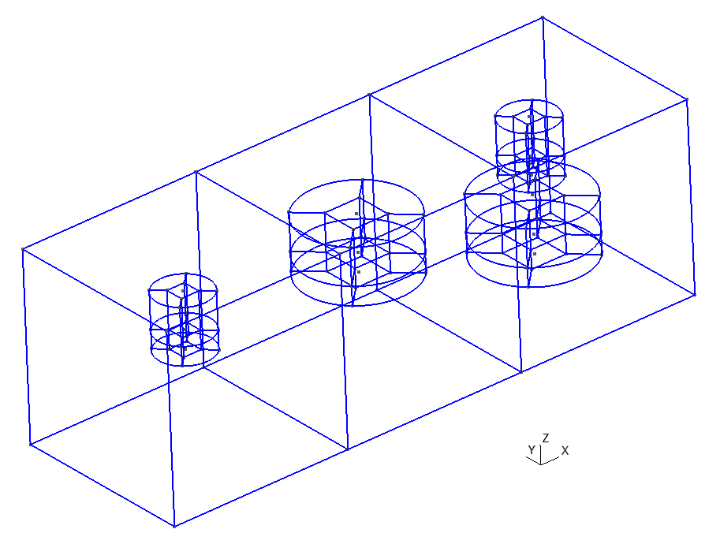

   Parent with ``items_children`` in ``geo_unrolled`` output format

After that we could add strategy to create the mesh.

.. code-block:: yaml
   :linenos:

   metadata:
     run:
       factory: geo
       strategy:
         class: strategy.NoBoolean
   data:
     class: block.Matrix
     matrix: [ [ 0;;2, 1;;2, 2;;2, 3;;2 ],
               [ 0;;2, 1;;2 ],
               [ 0;;2, 1;;2 ] ]
     items_zone: [ PARENT ]
     items_children: [
       [ /child_1.yaml ],
       [ /child_2.yaml ],
       [ /child_1.yaml, /child_2.yaml ],
     ]
     items_children_map: [
       0, 1, 2
     ]
     items_children_transforms: [
       [ [ ] ],
       [ [ [ 0, 0, 0.1 ] ], [ [ 0, 0, -0.3 ] ] ],
     ]
     items_children_transforms_map: [
       0, 0, 1
     ]
     items_do_structure_map: 1
     items_do_quadrate_map: 1

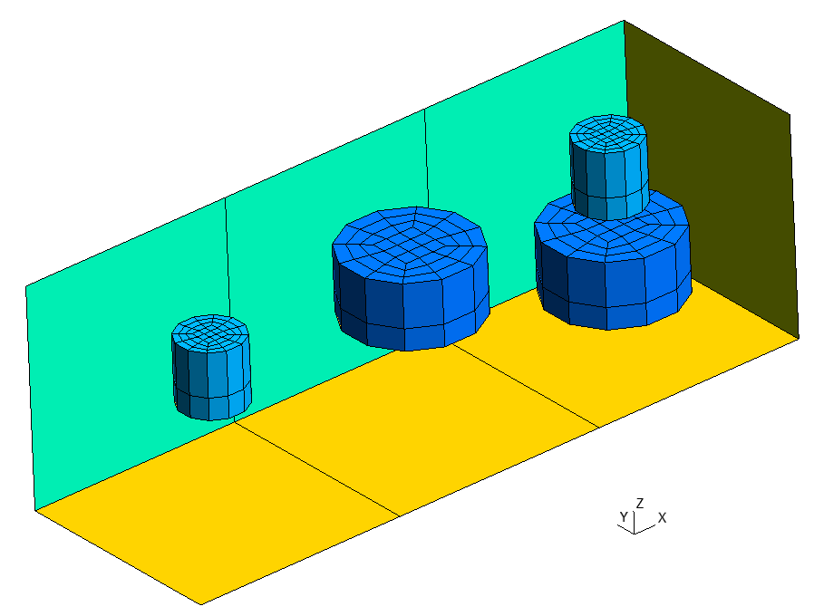

   Parent with ``items_children``

We could supress generation of items (not their children) by setting
``items_do_register_map`` to 0.

.. code-block:: yaml
   :linenos:

   metadata:
     run:
       factory: geo
       strategy:
         class: strategy.NoBoolean
   data:
     class: block.Matrix
     matrix: [ [ 0;;2, 1;;2, 2;;2, 3;;2 ],
               [ 0;;2, 1;;2 ],
               [ 0;;2, 1;;2 ] ]
     items_zone: [ PARENT ]
     items_children: [
       [ /child_1.yaml ],
       [ /child_2.yaml ],
       [ /child_1.yaml, /child_2.yaml ],
     ]
     items_children_map: [
       0, 1, 2
     ]
     items_children_transforms: [
       [ [ ] ],
       [ [ [ 0, 0, 0.1 ] ], [ [ 0, 0, -0.3 ] ] ],
     ]
     items_children_transforms_map: [
       0, 0, 1
     ]
     items_do_structure_map: 1
     items_do_quadrate_map: 1
     items_do_register_map: 0

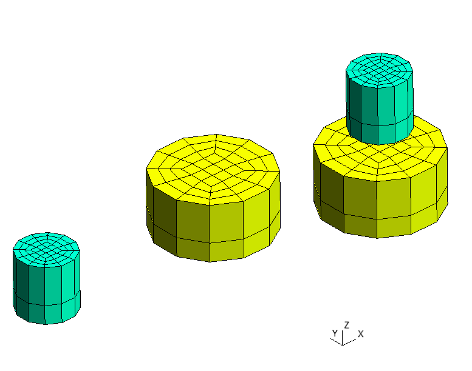

   Parent with ``items_children`` without ``items``

We could also create many copies of children inside an item adding additional
parameter after coordinate with ``:`` separator, e.g. ``5:4`` divides last item into
3 parts (with 4 nodes) and creates children inside each part.

.. code-block:: yaml
   :linenos:

   metadata:
     run:
       factory: geo
       strategy:
         class: strategy.NoBoolean
   data:
     class: block.Matrix
     matrix: [ [ 0;;2, 1;;2, 2;;2, 5:4;;2 ],
               [ 0;;2, 1;;2 ],
               [ 0;;2, 1;;2 ] ]
     items_zone: [ PARENT ]
     items_children: [
       [ /child_1.yaml ],
       [ /child_2.yaml ],
       [ /child_1.yaml, /child_2.yaml ],
     ]
     items_children_map: [
       0, 1, 2
     ]
     items_children_transforms: [
       [ [ ] ],
       [ [ [ 0, 0, 0.1 ] ], [ [ 0, 0, -0.3 ] ] ],
     ]
     items_children_transforms_map: [
       0, 0, 1
     ]
     items_do_structure_map: 1
     items_do_quadrate_map: 1
     items_do_register_map: 0

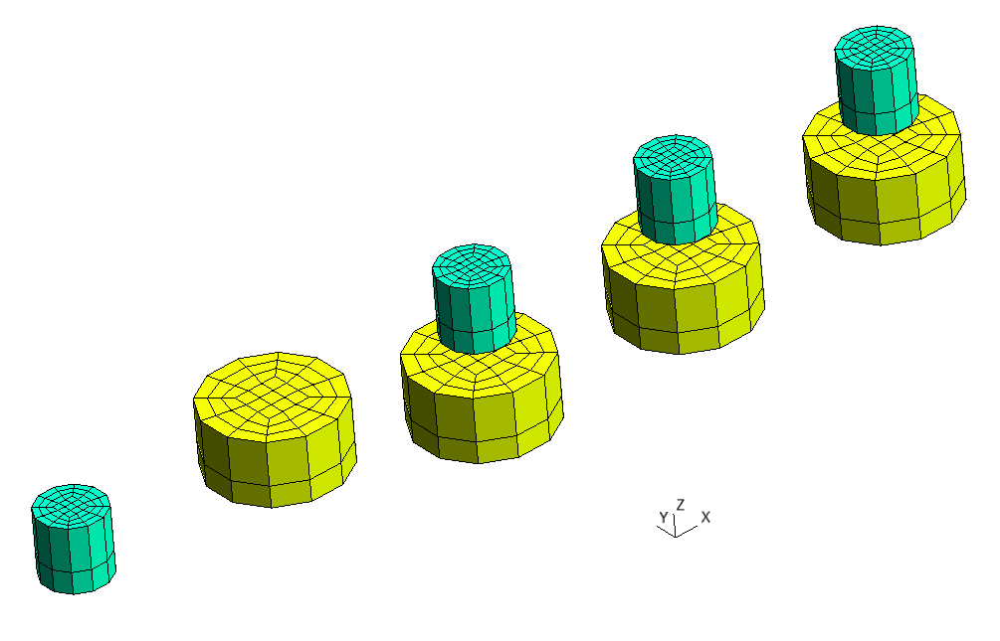

   Parent with ``items_children`` with extended third item

All together
------------

One could combine ``children`` and ``items_children``, e.g. to add
arbitrarily and regularly located children.

.. code-block:: yaml
   :linenos:

   metadata:
     run:
       factory: occ
       strategy:
         class: strategy.NoBoolean
   data:
     class: block.Matrix
     matrix: [ [ 0;;2, 1;;2, 2;;2, 5:4;;2 ],
               [ 0;;2, 1;;2 ],
               [ 0;;2, 1;;2 ] ]
     items_zone: [ PARENT ]
     children: [
       /child_1.yaml,
       /child_2.yaml
     ]
     children_transforms: [
       [ [ 0, -1, 0 ] ],
       [ [ 0, 2, 0 ] ]
     ]
     items_children: [
       [ /child_1.yaml ],
       [ /child_2.yaml ],
       [ /child_1.yaml, /child_2.yaml ],
     ]
     items_children_map: [
       0, 1, 2
     ]
     items_children_transforms: [
       [ [ ] ],
       [ [ [ 0, 0, 0.1 ] ], [ [ 0, 0, -0.3 ] ] ],
     ]
     items_children_transforms_map: [
       0, 0, 1
     ]
     items_do_structure_map: 1
     items_do_quadrate_map: 1
     items_do_register_map: 0

.. code-block:: shell

   python -m gmsh_scripts parent_all.yaml

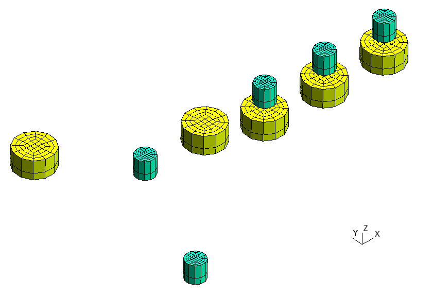

   Parent with ``children`` and ``items_children``

Mesh
----

To create mesh we need boolean operations that are available in ``occ`` factory.

.. warning::
   It's recommended to disable ``items_do_structure_map`` and ``items_do_quadrate_map``
   fields, i.e. to create unstructured tetrahedral mesh while using boolean operations
   to achieve better stability of mesh generation.

.. code-block:: yaml
   :linenos:

   data:
     class: block.Layer
     layer: [ [ 0.05;;4, 0.15;;4 ],
              [ 0.1;;2, 0.3;;2 ] ]
     layer_curves: [ [ line, circle_arc ],
                     [ line, line ] ]
     items_zone: [ CHILD_1 ]
     items_do_structure_map: 0
     items_do_quadrate_map: 0

.. code-block:: yaml
   :linenos:

   data:
     class: block.Layer
     layer: [ [ 0.1;;4, 0.3;;4 ],
              [ 0.1;;2, 0.3;;2 ] ]
     layer_curves: [ [ line, circle_arc ],
                     [ line, line ] ]
     items_zone: [ CHILD_2 ]
     items_do_structure_map: 0
     items_do_quadrate_map: 0

.. code-block:: yaml
   :linenos:

   metadata:
     run:
       factory: occ
   data:
     class: block.Matrix
     matrix: [ [ 0;;2, 1;;2, 2;;2, 5:4;;2 ],
               [ 0;;2, 1;;2 ],
               [ 0;;2, 1;;2 ] ]
     items_zone: [ PARENT ]
     children: [
       /child_1.yaml,
       /child_2.yaml
     ]
     children_transforms: [
       [ [ 0, -1, 0 ] ],
       [ [ 0, 2, 0 ] ]
     ]
     items_children: [
       [ /child_1.yaml ],
       [ /child_2.yaml ],
       [ /child_1.yaml, /child_2.yaml ],
     ]
     items_children_map: [
       0, 1, 2
     ]
     items_children_transforms: [
       [ [ ] ],
       [ [ [ 0, 0, 0.1 ] ], [ [ 0, 0, -0.3 ] ] ],
     ]
     items_children_transforms_map: [
       0, 0, 1
     ]
     items_do_structure_map: 0
     items_do_quadrate_map: 0
     items_do_register_map: 1

.. code-block:: shell

   python -m gmsh_scripts parent_all.yaml

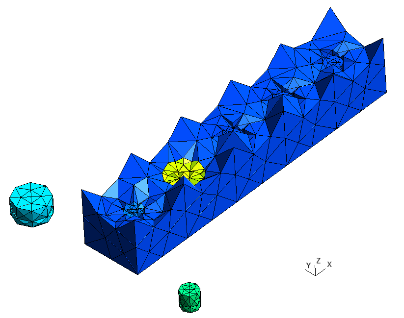

   Mesh generated with ``occ`` ``factory``

One could customize mesh quality using ``run.options`` fields, e.g:

1. ``Mesh.MeshSizeFactor`` - factor applied to all mesh element sizes,
2. ``Mesh.MeshSizeMin`` - minimum mesh element size,
3. ``Mesh.MeshSizeMax`` - maximum mesh element size,
4. ``Mesh.MeshSizeExtendFromBoundary`` - extend computation of mesh element sizes from the boundaries into the interior (``0``: never; ``1``: for surfaces and volumes; ``2``: for surfaces and volumes, but use smallest surface element edge length instead of longest length in 3D Delaunay; ``-2``: only for surfaces; ``-3``: only for volumes),
5. ``Mesh.MeshSizeFromCurvature`` - automatically compute mesh element sizes from curvature, using the value as the target number of elements per 2 * Pi radians.

.. note::
   See `documentation <https://gmsh.info/doc/texinfo/gmsh.html#Mesh-options>`_ of
   gmsh for more information about options and their description.

.. code-block:: yaml
   :linenos:

   metadata:
     run:
       factory: occ
       options:
         Mesh.MeshSizeFactor: 1.0
         Mesh.MeshSizeMin: 0.1
         Mesh.MeshSizeMax: 0.3
         Mesh.MeshSizeExtendFromBoundary: 2
         Mesh.MeshSizeFromCurvature: 12
   data:
     class: block.Matrix
     matrix: [ [ 0;;2, 1;;2, 2;;2, 5:4;;2 ],
               [ 0;;2, 1;;2 ],
               [ 0;;2, 1;;2 ] ]
     items_zone: [ PARENT ]
     children: [
       /child_1.yaml,
       /child_2.yaml
     ]
     children_transforms: [
       [ [ 0, -1, 0 ] ],
       [ [ 0, 2, 0 ] ]
     ]
     items_children: [
       [ /child_1.yaml ],
       [ /child_2.yaml ],
       [ /child_1.yaml, /child_2.yaml ],
     ]
     items_children_map: [
       0, 1, 2
     ]
     items_children_transforms: [
       [ [ ] ],
       [ [ [ 0, 0, 0.1 ] ], [ [ 0, 0, -0.3 ] ] ],
     ]
     items_children_transforms_map: [
       0, 0, 1
     ]
     items_do_structure_map: 0
     items_do_quadrate_map: 0
     items_do_register_map: 1

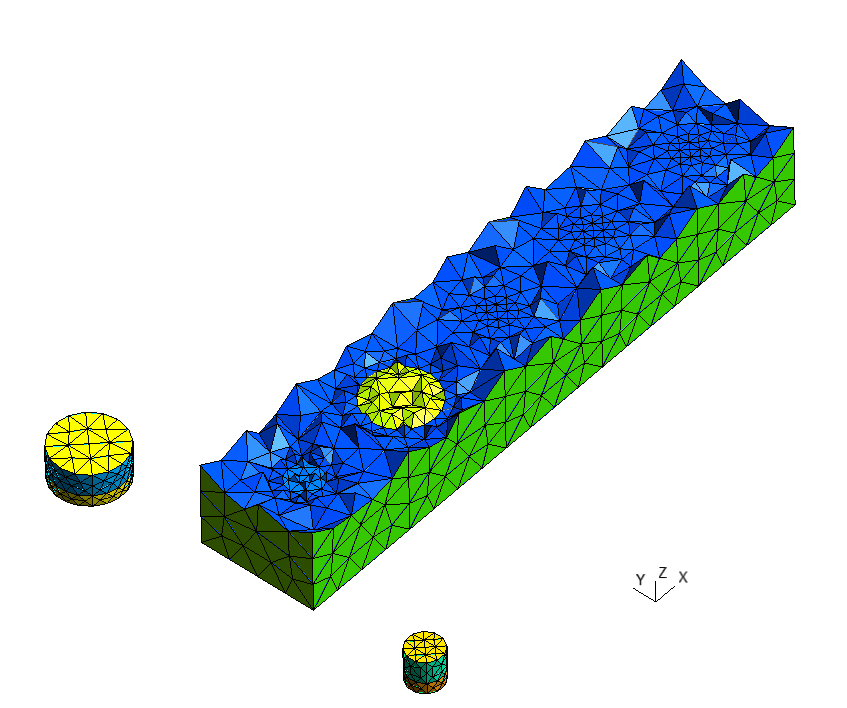

   Mesh configured with ``metadata.run.options``
