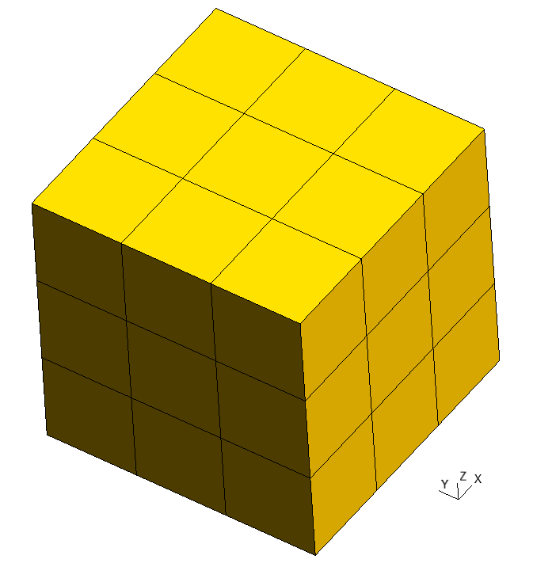
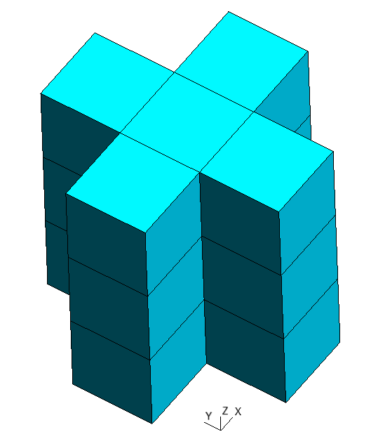
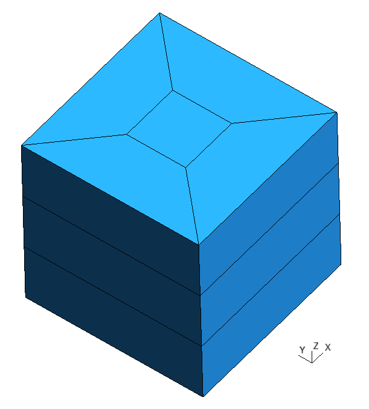
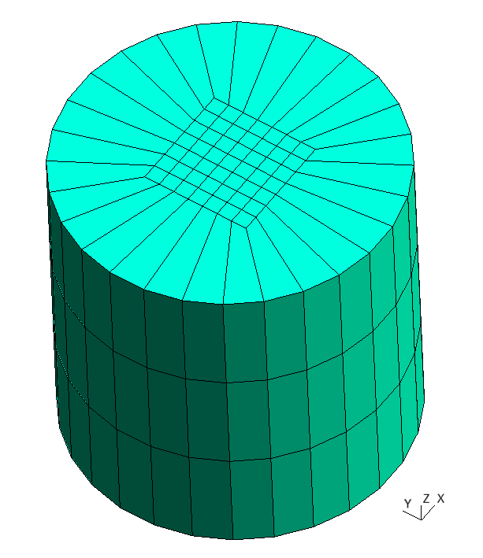
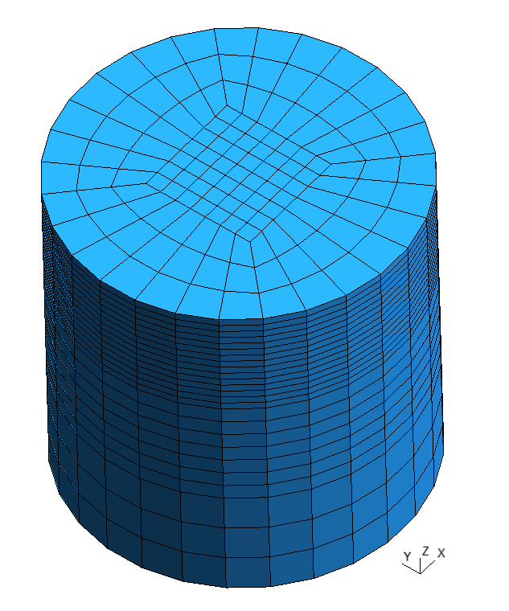
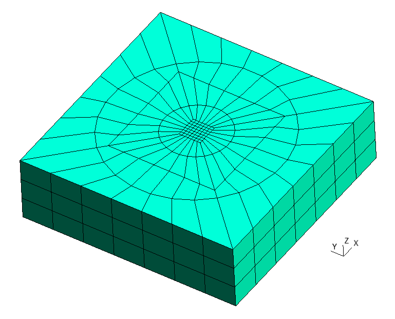
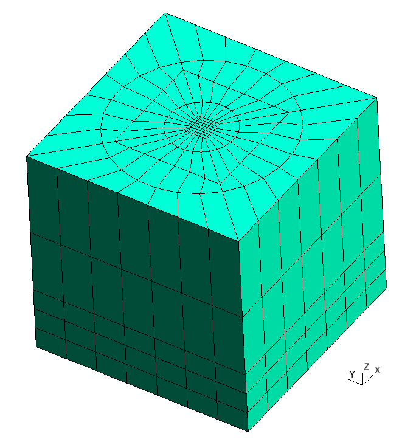
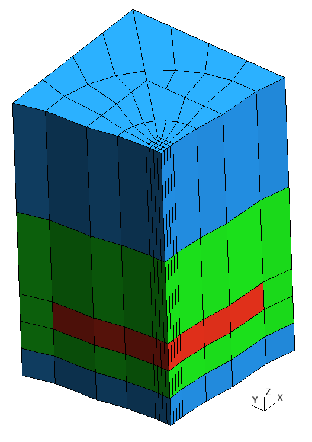
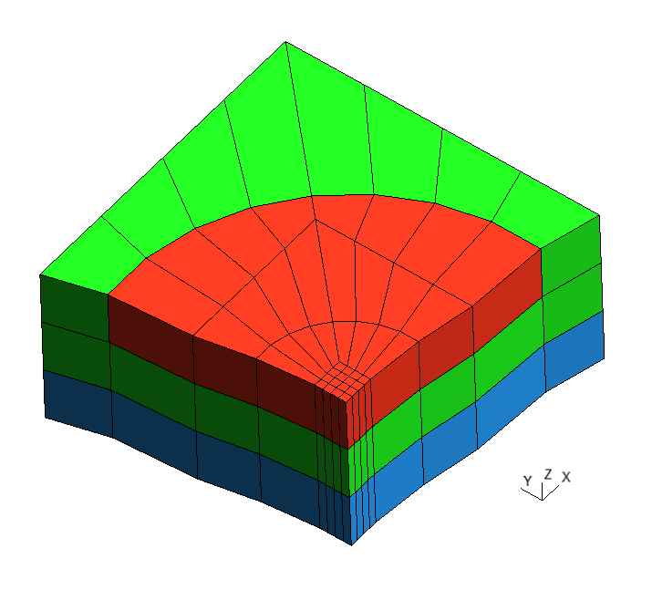

Simple Layer
============

Concept
-------

Class :py:class:`~gmsh_scripts.block.layer.Layer` is a successor of class
:py:class:`~gmsh_scripts.block.matrix.Matrix`, which is a collection of
:py:class:`~gmsh_scripts.block.block.Block` in a structure of 3D regular grid.

Class :py:class:`~gmsh_scripts.block.layer.Layer` removes
:py:class:`~gmsh_scripts.block.block.Block` from
:py:class:`~gmsh_scripts.block.matrix.Matrix` that do not have 0 coordinate by X or
Y axes and applies transformations to remaining blocks
:py:class:`~gmsh_scripts.block.block.Block` that are connect their sides.

   Matrix

   Filtered Matrix

   Layer

We can change type of surfaces by X and Y axes to curved ones. Number of nodes by
circumferential direction is determined by last number ``0.5;;8``
at first radial ``layer``:

.. code-block:: yaml
   :linenos:

   metadata:
     run:
       factory: geo
       strategy:
         class: strategy.NoBoolean
   data:
     class: block.Layer
     layer: [ [ 0.5;;8, 1.5;;2 ],
              [ 1;;2, 2;;2, 3;;2 ] ]
     "layer_curves": [ [ line, circle_arc ],
                       [ line, line, line ] ]
     items_do_structure_map: 1
     items_do_quadrate_map: 1

   Curved Layer

One can also change number of nodes by radial/height layer changing last number of
subfields of first/second ``layer``:

.. code-block:: yaml
   :linenos:

   metadata:
     run:
       factory: geo
       strategy:
         class: strategy.NoBoolean
   data:
     class: block.Layer
     layer: [ [ 0.5;;8, 1.5;;4 ],
              [ 1;;4, 2;;8, 3;;16 ] ]
     "layer_curves": [ [ line, circle_arc ],
                       [ line, line, line ] ]
     items_do_structure_map: 1
     items_do_quadrate_map: 1

   Layer with different number of nodes by radial/height layers

Number of layers
----------------

One can add radial layers by appending additional items in the first ``layer`` subfield:

.. code-block:: yaml
   :linenos:

   metadata:
   run:
     factory: geo
     strategy:
       class: strategy.NoBoolean
   data:
   class: block.Layer
   layer: [ [ 0.5;;8, 1.5;;2, 2.5;;2, 4;;2, 5;;2 ],
            [ 1;;2, 2;;2, 3;;2 ] ]
   "layer_curves": [ [ line, circle_arc, line, circle_arc, line ],
                     [ line, line, line ] ]
   items_do_structure_map: 1
   items_do_quadrate_map: 1

   Multi Layer

One can add height layers by appending additional items in the second ``layer`` subfield:

.. code-block:: yaml
   :linenos:

   metadata:
   run:
     factory: geo
     strategy:
       class: strategy.NoBoolean
   data:
   class: block.Layer
   layer: [ [ 0.5;;8, 1.5;;2, 2.5;;2, 4;;2, 5;;2 ],
            [ 1;;2, 2;;2, 3;;2, 6;;2, 10;;2 ] ]
   "layer_curves": [ [ line, circle_arc, line, circle_arc, line ],
                     [ line, line, line, line, line ] ]
   items_do_structure_map: 1
   items_do_quadrate_map: 1

   Multi Height Layer

Zones
-----

To specify zones one needs add ``items_zones`` and ``items_zones_map`` fields.
Where ``items_zones`` is a list of pairs of volume and six surfaces names, e.g.
``[ Volume, [ NX, X, NY, Y, NZ, Z ] ]``:

1. ``Volume`` - volume name
2. ``[ NX, X, NY, Y, NZ, Z ]`` - surfaces names:

   * ``NX`` - surface pointing in the opposite direction of X-axis
   * ``X`` - surface pointing in the direction of X-axis
   * ``NY`` - surface pointing in the opposite direction of Y-axis
   * ``Y`` - surface pointing in the direction of Y-axis
   * ``NZ`` - surface pointing in the opposite direction of Z-axis
   * ``Z`` - surface pointing in the direction of Z-axis

``items_zones_map`` (and all fields that ends with ``_map``) is an addressing array
between items (Blocks in Layer) and corresponding index in some list with properties
(e.g. ``items_zones``) and has shape ``number-of-height`` by ``number-of-radial`` layers.

If one want to assign zone names with index ``1`` from ``items_zones``
(``[ B, [ NX_B, X_B, NY_B, Y_B, NZ_B, Z_B ] ]``) to 3th height layer and
5th radial layer one can set ``1`` to ``items_zones_map`` at ``[3, 5]`` location.

In this example we set:

1. ``0`` index of ``items_zones`` to middle (3th) height layer by all radial layers except last (5th);
2. ``1`` index of ``items_zones`` to 2nd and 4th height layer by all radial layers and also last (5th) radial layer in the middle (3th) height layer;
3. ``2`` index of ``items_zones`` to bottom (1st) and top (5th) height layer by all radial layers.

.. code-block:: yaml
   :linenos:

   metadata:
     run:
       factory: geo
       strategy:
         class: strategy.NoBoolean
   data:
     class: block.Layer
     layer: [ [ 0.5;;8, 1.5;;2, 2.5;;2, 4;;2, 5;;2 ],
              [ 1;;2, 2;;2, 3;;2, 6;;2, 10;;2 ] ]
     "layer_curves": [ [ line, circle_arc, line, circle_arc, line ],
                       [ line, line, line, line, line ] ]
     items_do_structure_map: 1
     items_do_quadrate_map: 1
     items_zone: [
       [ Red, [ NX, X, NY, Y, NZ, Z ] ],
       [ Green, [ NX, X, NY, Y, NZ, Z ] ],
       [ Blue, [ NX, X, NY, Y, NZ, Z ] ]
     ]
     items_zone_map: [
       [ 2, 2, 2, 2, 2],
       [ 1, 1, 1, 1, 1],
       [ 0, 0, 0, 0, 1],
       [ 1, 1, 1, 1, 1],
       [ 2, 2, 2, 2, 2]
     ]

   Section by X and Y axes of Layer with zones: red - ``0``, green - ``1``, blue - ``2``

   Section by X, Y and Z axes of Layer with zones: red - ``0``, green - ``1``, blue - ``2``